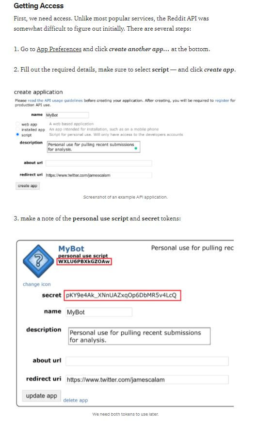

# Reddit API
1. Make a Reddit account
2. Follow the steps in this screenshot which are the first steps from this [guide](https://towardsdatascience.com/how-to-use-the-reddit-api-in-python-5e05ddfd1e5c).



3. Create a `secrets.py` file and include the following:

```
REDDIT_API_CLIENT_ID = ""
REDDIT_API_CLIENT_SECRET = ""
REDDIT_API_USER_AGENT = ""
```

Put this file in your main directory and remember to add it to `.gitignore`.

4. Browse Reddit when you finish to come up with some interesting subreddits that you would like to scrape data from.
5. Lastly, the Python package we will be using is called [PRAW](https://praw.readthedocs.io/en/stable/). Check it out!

# HuggingFace API
* In this excercise we will be using [HuggingFace](https://huggingface.co/) to help us analyze some Reddit data. 